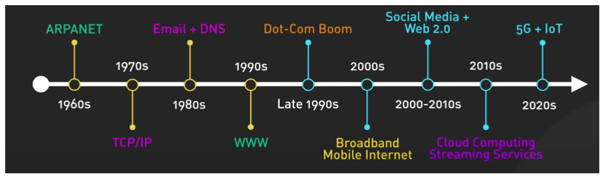
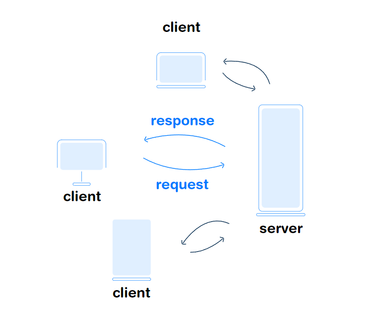
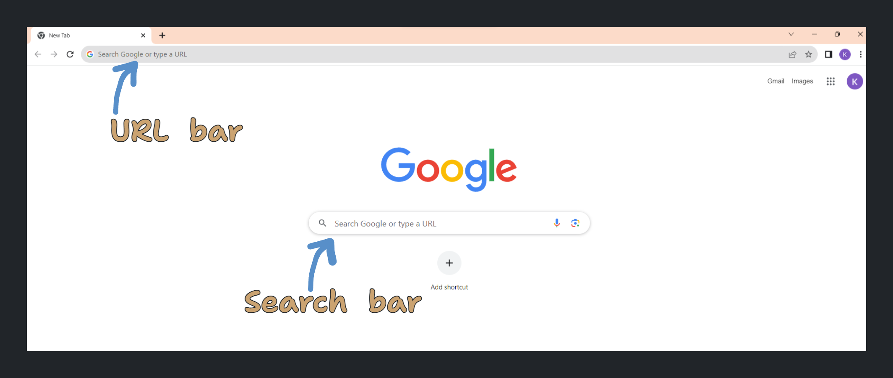
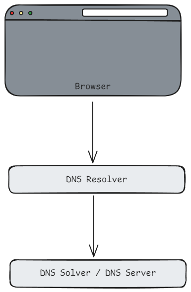
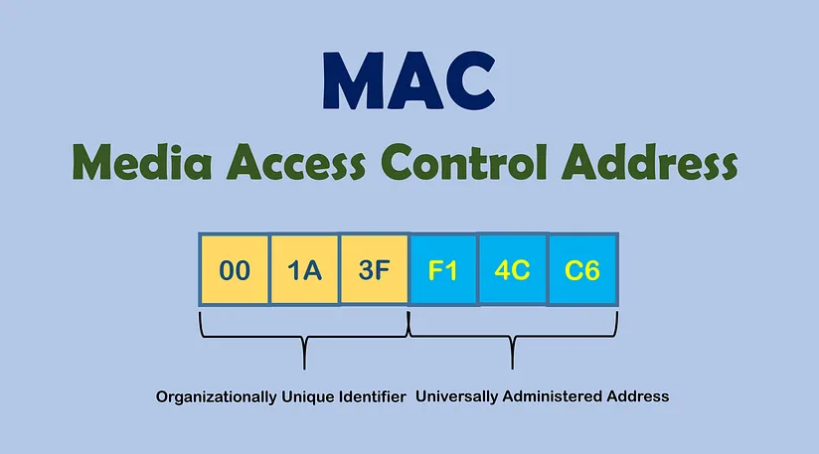
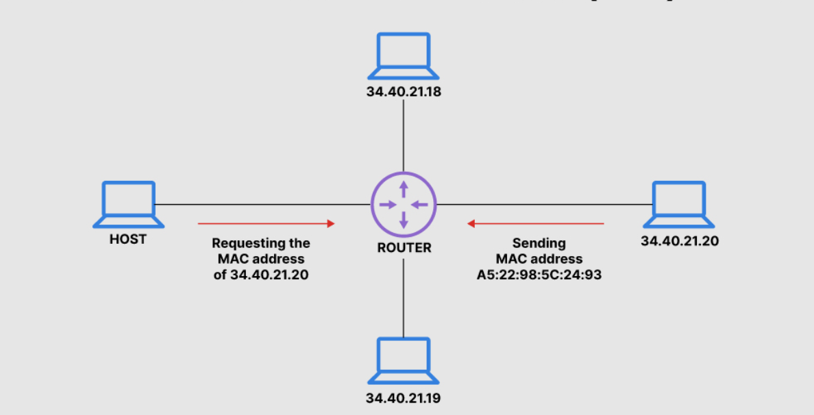

# Web Development

Web development involves designing, building, and launching functional, interactive and visually appealing websites and applications. It can range from creating a simple static page to developing complex web-based applications, online businesses, and social networks.

But before that we need to understand the basics of the internet and how it connect devices and how data is transferred between them. Then, we'll cover the HTTP protocol, the backbone of web communication, followed by an introduction to APIs, which are essential for modern web applications to work. We’ll also touch on web security, although it’s a vast topic, we’ll cover the basics.

## 1. Internet

A global network of computers that are connected to each other. It allows computers to communicate with each other and share information. _A Network of Networks_.

**Internet Timeline**



> Diagram by Alex Xu

## 2. Webpage - Website - Web Application

   - `Website` is a collection of web pages.

   - `Webpage` is a single document within a website.

   - `Web application` is a type of website that allows users to interact with it. It's more dynamic and interactive than a static website.

## 3. Browser** 

The software you use to access the internet. It's a complex tool that handles many tasks in the background. Almost all modern browsers uses something called `Chromium`; an open source browser project under the hood. It's really difficult to build a complete browser package from scratch.

> Eg; `Google Chrome`, `Firefox`, `Safari`, `Microsoft Edge`, `Opera`, etc.

## 4. Server**

A computer that is always connected to the internet and is responsible for responding to the requests made by the browser. It can be a physical machine or a virtual machine.

> It's also described as a software that runs on a computer and listens for incoming requests.

The technology in which the network load is distributed between servers and service customers is called **Client-Server Architecture**.



---
## How the Web Works

When we search something or request a web page by clicking a link, the browser goes through several steps to retrieve the requested data from a server and display it as a webpage. This process is called the **Web Page Request Lifecycle**. Let's look at this process in detail.

### Distinguish between a URL and a Search Query

The first thing the browser need to figure out is whether we have given a search query or a **URL** (Uniform Resource Locator).

> Eg; `https://www.google.com/` or `How to make a cup of coffee?`



> In modern browsers both can be done from the same input field (Omni-box).

When we enter the first character in the **URL bar**, the keyboard would send an [interrupt](https://en.wikipedia.org/wiki/Interrupt) and the browser would receive an event. Then depending on factors like _search history, bookmarks, private/incognito mode, cookies_, etc. the browser would then show the suggestions.

> Browsers uses various techniques to identify whether a given input is a URL or a search query. Like checking for particular keywords, checking for the presence of a protocol, etc.

- For our purpose we are going to assume that the input is a **URL**.

Once we enter the complete URL and press enter, the following things happens;

- Parsing of the URL.

- DNS Lookup.

- Establishing connection with the server (TCP/TLS Handshake).

- HTTP Request Sent to the server to fetch the data.

- Server Processes Request.

- Server sends back the response.

- Browser receives the response, execute JS scripts required and renders the page.

## Parsing URL

The standard structure of a URL is as follows;


```h
https://www.example.com:443/product/electric/phone?price=15000#id
```

Now we won't type something like this always; we usually type something simple like `example.com`. It's the browser that parse the given url and complete the missing parts. Let's see how it does that.

- **`https`** (_Hyper Text Transfer Protocol Secure_) is the `protocol` that tells the browser how to connect to the server.

> Other protocols include `http` (_Hyper Text Transfer Protocol_), `ftp` (_File Transfer Protocol_), and `ssh` (_Secure Shell_).

- **`example.com`** is the domain, and `www` is the subdomain.

- `.com` is the top-level domain, indicating the type of website.

- `443` is the port for `https`. `80` is the one for `http`. It is optional.

- `/product/electric/phone` is the `path` to the resource on the server.

- `?price=15000` is the `query parameters` that are sent to the server.

- `#id` is the `fragment` that is used to scroll to a specific part of the page.

The browser maintains a list of `HSTS` (_HTTP Strict Transport Security_) websites where the browser would only contact the server via `https`. This is to prevent `man-in-the-middle` attacks. The browser also maintains a list of `cookies` that are sent to the server.

## DNS Lookup

After parsing the URL, the browser has the following information:

- `Protocol`

- `Domain`

- `Sub-domain`

- `Port`

- `Query parameters`

- `Fragment`

- `HSTS list`

- `Cookies`

Next, the browser finds the server's unique **`IP address`** (Internet Protocol Address) using a process called `DNS lookup` (Domain Name System). IP address is a unique identifier for a computer on a network, which is used to locate and communicate with it.

DNS lookup translates a human-readable domain name into an IP address. The browser checks multiple places for this address, heavily relying on cached data for performance.

- The browser first checks its own browser cache.

- Then, the operating system checks its DNS cache.

- Each DNS record has a Time-to-Live value, indicating how long the information is valid (or how long it should be cached).

- If these attempts fail, the browser queries a DNS resolver (on the internet), initiating a recursive search for the IP address.

<p align="center">
  
</p>

- A **DNS resolver** handles queries from client machines like browsers, either responding with cached data or querying a root server to resolve the domain name.

- A **DNS server** is a computer that holds a database of public IP addresses and their associated hostnames, translating these names to IP addresses as requested.

The entire process of finding a domain's IP address, including DNS lookup, is known as DNS resolution.

## Establishing connection with the server

Once the browser has the IP address, it establishes a connection with the server using protocols like `TCP`
transmission control protocol for http or `TLS` transport layer security for https.

### ARP (Address Resolution Protocol)

- The browser uses `ARP` to map the IP address to a `MAC address` (Media Access Control Address, the physical address on the machine's network card). This is done by broadcasting a message to all the machines in the network. The machine with the requested IP address would respond with its MAC address.





### TCP Handshake

After obtaining the MAC address; a `TCP Handshake` is initiated.

- The client sends a SYN (Synchronization) packet.

- The server responds with a SYN-ACK packet.

- The client sends an ACK packet.

This completes the TCP Handshake. In order to close a connection, a `TCP Termination` or 4-way handshake is initiated.

- The client sends a FIN (Finish) packet.

- The server responds with a FIN-ACK packet.

- The client sends an ACK packet.

Browsers keep the connection open for a particular period of time using a `Keep-alive connection` (also known as `HTTP persistent connection`) to speed up loading. This reduces the number of round trips needed to establish a connection.

### TLS Handshake

A `TLS handshake` involves encryption and decryption, making it more complex than a TCP handshake. Techniques like `session resumption` are used to reduce the cost of this process.

- The client sends a `ClientHello` message with its **TLS version, list of cipher algorithms, and compression methods**.

- The server replies with a `ServerHello` message, including its TLS version, selected cipher, compression methods, and a public certificate.

- The public certificate contains the server's public key and information about it.

- The client verifies the certificate and encrypts a string of random bytes with the server’s public key.

- The server decrypts this with its private key to create a symmetric master key.

- The client sends a Finished message, encrypted with the symmetric key.

- The server verifies this by sending its own Finished message.

## Sending data to the server

After establishing the connection, the client sends an HTTP request to the server. The request includes things like:

- `Request line` (GET, POST, PUT, DELETE, etc.)

- `Headers` (metadata about the request)

- `Body` (data sent to the server)

And many more. The server processes this request and sends back a response. We will discuss more about the HTTP protocol latter. The request goes through various networking layers:

1. **Transport layer** : Adds the destination port to the header, creating a TCP segment. When we prefer connection speed over reliability, we use `UDP` (User Datagram Protocol), it is connection-less and faster.

2. **Network layer** : Routes the data by adding the destination IP address and selecting a source IP address.

3. **Data link layer** : Adds MAC addresses and handle framing and reassembly. (Breaking data into frames for transmission and reassembling received frames into data).

The data reaches the router, which forwards it to the server. The server then sends a response back to the client.

Once the client receives the response, it goes through the same networking layers in reverse order. The browser then processes the response and renders the page.

> More on [HTTP-protocol, How computers talk to each other...](HTTP.md)
