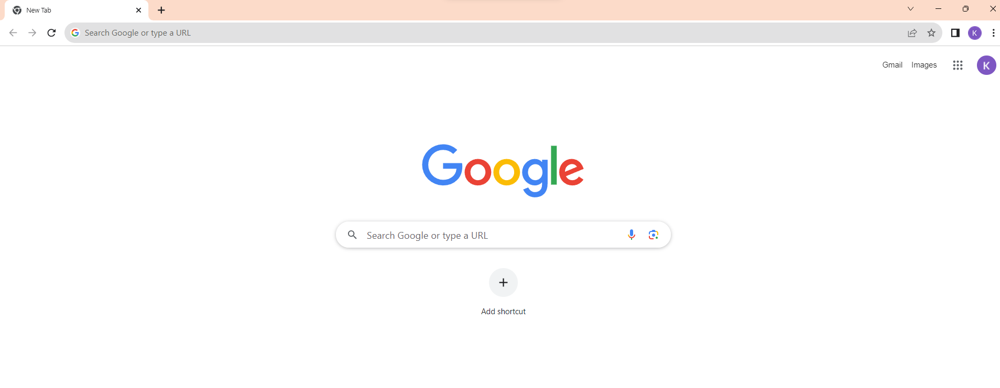

<div align="center">

# Web page Request Lifecycle 🌀

</div>

The web page request lifecycle is the process of how a web page is loaded on your browser. Let's understand this with an example.

## What happens when we click on **[Google.com](https://www.google.com/)** ?🤔



We type our `query` { *What we want to search* } in the **URL bar** of a browser and upon pressing enter we get the results. But lets see what happens in the background ? 

 ### Is it a URL ⌨️ or a search query 🔍?

 - The first thing the browser need to figure out is whether we have give a search query or a URL. When we type the first character in the **URL bar**, the keyboard would send an [interrupt](https://en.wikipedia.org/wiki/Interrupt) and the browser would receive an event. Depending on factors like *search history, bookmarks, private/incognito mode, cookies*, etc. the browser would show the suggestions.

 - Once we enter the URL and press enter, the first thing happens is the parsing of the URL. After parsing the browser now has the `protocol`, and `Resource /` . When no protocol is specified, the browser would assume it to be `search query` and provide it to the search engine.

 > Browsers uses various techniques to identify whether a given input is a URL or a search query. Like checking for particular keywords, checking for the presence of a protocol, etc.

{ for simplicity we are assuming it to be URL }.

The original URL won't be `Google.com`; it would be something like `https://www.google.com/`. Let's take a closer look at this **URL** (`Uniform Resource Locator`).

**`https://www.google.com/` wait that's a lot😵**

- `https` is knows as `schema` or `protocol`, 

- `google.com` is the domain and `www` would be the sub domain. 
The subdomain `www` is not mandatory, it stands for **World Wide Web**. Now we are using many other sub-domains instead of this.

- Then we have the top level domain `.com`. It is used to identify the type of the website. 
For example, `.com` is used for commercial websites, `.org` is used for non-profit organizations, `.edu` is used for educational websites, etc.

- We can optionally add the port also; which in this case is `443`. With `https` it can be left off. The default port with `https` is **443**. The default port with `http` is **80**. 

- We can also pass query parameters to the URL for filtering out more content. For example;
```h
https://www.amazon.com/mobile_phone?price=15000
```
> This would show all the phones in amazon with price = 15000.

 - We can also add something known as **fragment** 
 ```h
 # id
 ```
> This would scroll on to the element with the id, when the page is loaded.
### Working

<details>
    <summary> URL Parsing </summary>

Once the browser has the URL parsed, it has all the necessary information to proceed further.

- Next thing the browser does is checking  the `HSTS` list, `HTTP Strict Transport Security list`. This is a list of websites that have requested to be contacted via HTTPS only. But those websites that are not in the list can still be contacted via HTTPS.

- The now has the following things; 
    - `Protocol` 
    - `Domain`
    - `Sub-domain`
    - `Port`
    - `Query parameters`
    - `Fragment`
    - `HSTS list`

</details>

<details>
    <summary> DNS Lookup </summary>

DNS lookup is the process of translating a human-readable domain name into a computer-readable **IP address**. This is done by querying a DNS server, which is a computer that stores information about domain names and their corresponding IP addresses. The entire process of finding the IP address of a domain name, including the DNS lookup is known as **DNS resolution**. It also includes the steps that are taken to cache the IP address so that it can be quickly retrieved the next time the domain name is requested.

- First the browser will check its `local cache` for the IP address of the domain. If the IP address is not in the cache, the computer will then contact a `recursive resolver` { **Resolving Name server** }.

- The recursive resolver is a DNS server that is responsible for resolving domain names to IP addresses. The resolver will first check its own cache for the IP address of the domain. If the IP address is not in the cache, the resolver will then contact a `root name server`.

    - The root name servers are a set of 13 servers that are responsible for storing the mapping of `top-level domains` (TLDs) to their `authoritative name servers`. 
    
    > Today each of the 13 IP addresses has several servers, which use Anycast routing to distribute requests based on load and proximity. Right now there are over 600 different DNS root servers distributed across every populated continent on earth.

 <details>
    <summary> Address Resolution Protocol (ARP) </summary>

**IP vs. MAC Addresses**:

In computer networking, devices are identified by both IP addresses and MAC addresses.
IP addresses are used for logical addressing and routing within a network. They are assigned to devices to enable communication across different networks.

MAC addresses, on the other hand, are physical addresses assigned to network interface cards (NICs) at the manufacturing level. They are used for communication within a local network segment.

**Need for ARP**:

When a device on a local network wants to send data to another device within the same network, it needs to know the recipient's MAC address.

Since devices primarily use IP addresses for communication, there must be a way to map an IP address to the corresponding MAC address. This is where ARP comes in.

**ARP Request**:

When a device wants to send data to another device but only knows its IP address, it broadcasts an ARP request message on the local network.

The ARP request contains the sender's IP address and MAC address and the target device's IP address. It effectively asks, `"Who has this IP address, and what is your MAC address?"`
    
**ARP Reply**:

The device with the requested IP address, upon receiving the ARP request, sends back an ARP reply. The ARP reply includes the sender's IP and MAC addresses, as well as the requested IP address's MAC address.

This response essentially says, `"I have the IP address you're looking for, and here's my MAC address."`

**ARP Table**:

Both the requesting device and the device providing the reply update their ARP tables. These tables map IP addresses to MAC addresses.

This mapping is cached for a certain period to avoid frequent ARP requests for the same devices.


ARP stands for Address Resolution Protocol. It is a Layer 2 protocol that is used to map IP addresses to MAC addresses. MAC addresses are physical addresses that are assigned to network adapters.

ARP is not always accurate and can be vulnerable to attacks, But it efficient and scalable.
   
</details>

</details>

 <details>
    <summary> HTTP Requests </summary>

Once the IP address is obtained the browser would try to open a **TCP socket stream** to the server. Then the request passes through various networking layers like : 

1. **Transport layer**

Destination port is added to the header, source port is selected and thus a TCP segment is created.

2. **Network layer**

Ip address of the destination is added to the header, source ip address is selected and thus an IP packet is created.

3. **Data link layer**

MAC address of the machine's NIC and gateway(local router) is added.

After this the data is ready to be transmitted by the means of the physical layer (Ethernet, WiFi, Cellular data network, etc.). Eventually the data reaches the **router** managing the local subnet and travels further to the destination server.

</details>

### Protocols

We send information in the form of packets. The request from client to server would be sent using the **TCP** protocol. The server would respond with the HTML file. The browser would then parse the HTML file and render the page.  

- To initiate the connection between the client and the server; first the client send over a special packet called **SYN** or Synchronization Packet. The server would respond with a **SYN-ACK** packet. The client would then send an **ACK** packet. This is known as **TCP Handshake** or a **3-way handshake**.

- In order to finish the connection between the client and the server; the client would send a **FIN** packet. The server would respond with a **FIN-ACK** packet. The client would then send an **ACK** packet. This is known as **TCP Termination** or a **4-way handshake** (4 way because ending connection from both the sides).

- TCP handshake confirms the transmission (**SYN,SYN/ACK,ACK**) and the termination (**FIN,FIN/ACK,ACK**) of the connection.

After the TCP handshake, `TLS handshake` takes place. `TLS` stands for **Transport Layer Security**. It is a protocol that provides security over the internet. It is used to encrypt the data that is being sent over the internet.

- The client computer sends a `ClientHello` message to the server with its TLS version, list of cipher algorithms and compression methods available.

- The server replies with a `ServerHello` message to the client with the TLS version, selected cipher, selected compression methods and the server's public certificate signed by a `CA` (Certificate Authority). The server's public certificate contains the server's public key.

- The client verifies the digital certificate against its list of trusted CAs. If trust can be established based on the CA, the client generates a string of pseudo-random bytes and encrypts this with the server's public key.

- The server decrypts the random bytes using its private key and uses these bytes to generate its own copy of the symmetric master key.

- The client sends a Finished message to the server, encrypting a hash of the transmission up to this point with the symmetric key.

- The server generates its own hash, and then decrypts the client-sent hash to verify that it matches. If it does, it sends its own Finished message to the client, also encrypted with the symmetric key.

> More on **HTTP**, [How computers talk to each other..](HTTP.md)