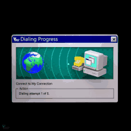

## Web Development 🕸️

Web development is the dynamic process of conceptualizing, designing, building, and deploying high-quality, interactive, and visually stunning websites and applications.

## Web page Request Lifecycle 🌀

Ever wondered how a web page is loaded on your browser? 🤔 Let's take a look at the request lifecycle.

### What happens when we click on **[Google.com](https://www.google.com/)** ?

The original URL won't be `Google.com`; it would be something like `https://www.google.com/`. Let's take a closer look at this **URL** (`Uniform Resource Locator`).

- Here `https` is called `schema` or `protocol`, `google.com` is the domain and `www` would be the sub domain. The subdomain `www` is not mandatory, it stands for **World Wide Web**. Now we are using many other sub-domains instead of this.

- Then we have the top level domain `.com`. There are many top level domains now. Some of them are `.org`, `.net`, `.edu`, `.gov`, `.in` etc. The top level domain is used to identify the type of the website. For example, `.com` is used for commercial websites, `.org` is used for non-profit organizations, `.edu` is used for educational websites, `.gov` is used for government websites and `.in` is used for Indian websites. 

- We can optionally add teh port also; which in this case is `443`. With `https` it can be left off. The default port with `https` is **443**. The default port with `http` is **80**. 

We can also pass query parameters to the URL for filtering out more content. For example;
 - `https://www.amazon.com/mobile_phone?price=15000` This would show all the phones in amazon with price = 15000.

 We can also add something known as fragment which the id of an element followed by a `#` symbol. What it does is it would scroll on to that element by default when the page loads.

 ### How it works 
 

 - When we type the first character in the **URL bar**, the keyboard would send an interrupt and the browser would receive an event. Depending on factors like search history, bookmarks, private/incognito mode, cookies, etc. the browser would show the suggestions.

 - Once we enter the URL and press enter, the first thing happens is the parsing of the URL. After parsing the browser now has the `protocol`, and `Resource /` . When no protocol is specified, the browser would assume it to be search query and provide it to the search engine (for simplicity we are assuming it to be **URL**).

 - Next the browser checks the `HSTS` list, `HTTP Strict Transport Security list`. This is a list of websites that have requested to be contacted via HTTPS only. But those websites that are not in the list can still be contacted via HTTPS.

 - Then the browser would perform **DNS lookup**. It is the process by which the browser checks if the domain is in its cache. If the information is not in the cache, the browser would check the **local router** or the **ISP's caching DNS server**. 
 
 - If the DNS server is on the same subnet; the network library follows the ARP process below;
    > The Address Resolution Protocol (ARP) is used to map a network address (such as an IP address) to a physical address (such as a MAC address). When the target IP address is not in the ARP cache, the network stack library sends an ARP request using the MAC address of the interface it will use to send the request. The ARP request is broadcasted to all devices on the local network, and the response depends on the type of hardware between the computer and the router (directly connected, hub, or switch). Once the IP address of either the DNS server or default gateway is obtained, the DNS process can resume. If the local/ISP DNS server does not have the requested information, a recursive search is requested until the SOA is reached and an answer is returned.

    - The browser would send an ARP request to the router asking for the MAC address of the DNS server.
    - The router would respond with the MAC address of the DNS server.
    - The browser would then send a DNS request to the DNS server.
    - The DNS server would respond with the IP address of the website.

- If local cache does not have the IP address, it would check the cache of **Resolving Name server**`

- If the `Resolving Name server` does not have the IP address, it would check the cache of **Root Name server**. `Resolving Name server` contains mapping of top level domains to the IP addresses

- If the `Root Name server` does not have the IP address, it would check the cache of **Top Level Domain Name server**. It would point out the `Resolving Name server` towards the `Authoritative Name server` of the domain, which would have the IP address of the domain.

 - Once the IP address is obtained the browser would try to open a TCP socket stream to the server. 
 Then the request passes through various layers like : 

    1. Transport layer where;
   > Destination port is added to the header, source port is selected and thus a TCP segment is created.

    2. Network layer where;
   > Ip address of the destination is added to the header, source ip address is selected and thus an IP packet is created.

    3. Data link layer where;
   > MAC address of the machine's NIC and gateway(local router) is added.

- After this the data is ready to be transmitted by the means of the physical layer (Ethernet, WiFi, Cellular data network, etc.)

- Eventually the data reaches the **router** managing the local subnet and travels further to the destination server.

### Protocols

- The request from client to server would be sent using the **TCP** protocol. The server would respond with the HTML file. The browser would then parse the HTML file and render the page. We send information in the form of packets. 

- To initiate the connection between the client and the server; first the client send over a special packet called **SYN** or Synchronization Packet. The server would respond with a **SYN-ACK** packet. The client would then send an **ACK** packet. This is known as **TCP Handshake** or a **3-way handshake**.

- In order to finish the connection between the client and the server; the client would send a **FIN** packet. The server would respond with a **FIN-ACK** packet. The client would then send an **ACK** packet. This is known as **TCP Termination** or a **4-way handshake** (4 way because ending connection from both the sides).

- TCP handshake confirms the transmission (**SYN,SYN/ACK,ACK**) and the termination (**FIN,FIN/ACK,ACK**) of the connection.

- After the TCP handshake, `TLS handshake` takes place. `TLS` stands for **Transport Layer Security**. It is a protocol that provides security over the internet. It is used to encrypt the data that is being sent over the internet.
    - The client computer sends a ClientHello message to the server with its TLS version, list of cipher algorithms and compression methods available.

    - The server replies with a `ServerHello` message to the client with the TLS version, selected cipher, selected compression methods and the server's public certificate signed by a CA (Certificate Authority). The server's public certificate contains the server's public key.

    - The client verifies the digital certificate against its list of trusted CAs. If trust can be established based on the CA, the client generates a string of pseudo-random bytes and encrypts this with the server's public key.
    - The server decrypts the random bytes using its private key and uses these bytes to generate its own copy of the symmetric master key.

    - The client sends a Finished message to the server, encrypting a hash of the transmission up to this point with the symmetric key.

    - The server generates its own hash, and then decrypts the client-sent hash to verify that it matches. If it does, it sends its own Finished message to the client, also encrypted with the symmetric key.

**Here we have discussed how the browser works and how the data is transmitted over the internet. We have also discussed the protocols that are used to transmit the data.**

> More on **HTTP**, [How computers talk to each other..](HTTP.md)