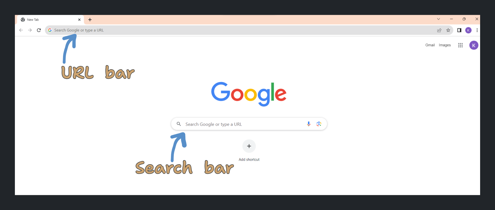
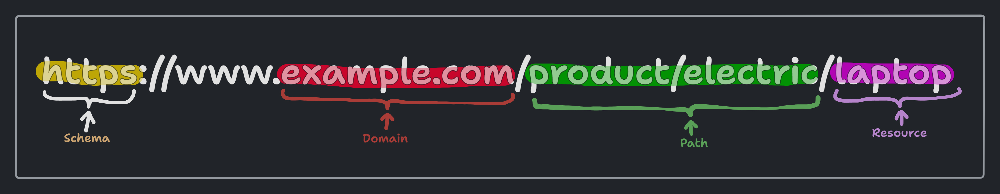
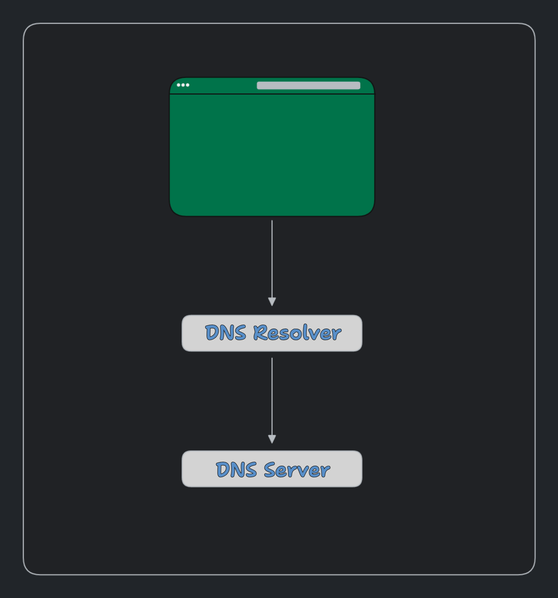

<h1 align="center"> Web page Request Lifecycle 🌀 </h1>

The process by which a web page is requested and rendered is known as **Web page Request Lifecycle**. It is a very complex process and involves many steps. Let us see what happens when we click on a link or type a URL in the browser.



## Is it a URL ⌨️ or a search query 🔍?

- The first thing the browser need to figure out is whether we have give a search query or a URL (Uniform Resource Locator). When we type the first character in the **URL bar**, the keyboard would send an [interrupt](https://en.wikipedia.org/wiki/Interrupt) and the browser would receive an event. Depending on factors like _search history, bookmarks, private/incognito mode, cookies_, etc. the browser would then show the suggestions.

  > Browsers uses various techniques to identify whether a given input is a URL or a search query. Like checking for particular keywords, checking for the presence of a protocol, etc.

**{ for simplicity and our purpose we are assuming it to be URL }**

- Once we enter the URL and press enter, the first thing happens is the parsing of the URL. The original URL won't be `example.com`; it would be something like `https://www.example.com/`. let us down the URL and see what each part means.



<details>
    <summary> <h3>URL Parsing</h3> </summary>

- `https` is knows as `schema` or `protocol` - This tells the browser to connect to server using a protocol called `https` { _Hyper Text Transfer Protocol Secure_ }.

  > There are other protocols like `http` { _Hyper Text Transfer Protocol_ : not encrypted}, `ftp` { _File Transfer Protocol_ }, `ssh` { _Secure Shell_ }, etc.

- `example.com` is the domain and `www` would be the sub domain. We can also call `com` as top level domain.

- Then we have the top level domain `.com`. It is used to identify the type of the website.

  > We can optionally add the port also; which in this case is `443`. With `https` it can be left off. The default port with `https` is **443**. The default port with `http` is **80**.

- We can also pass query parameters to the URL (added after `?`). For example;

  ```h
  https://www.example.com/product/electric/phone?price=15000
  ```

  > This would show all the phones in the website with price = 15000.

- We can also add something known as **fragment**

  ```h
  # id
  ```

  > This would scroll on to the element with the id, when the page is loaded.

Once the browser has the URL parsed, it has all the necessary information to proceed further, like;

- `Protocol`
- `Domain`
- `Sub-domain`
- `Port`
- `Query parameters`
- `Fragment`
- `HSTS list`
- `Cookies`

> `HTTP Strict Transport Security list`, is a list of websites that have requested to be contacted via HTTPS only and `Cookies` are small pieces of data that are stored in the browser.

</details>

Once the browser has parsed the URL, it needs to find a way to reach the server. It does this by finding a unique address of the server. This address is called `IP address` { _Internet Protocol Address_ } and the process of finding this address is called `DNS lookup` { _Domain Name System_ }.

<details>
    <summary> <h3> DNS Lookup </h3> </summary>

DNS lookup is the process of translating a human-readable domain name into a computer-readable **IP address**. This by itself involves a number of steps and processes.

For performance considerations, the data involved in DNS lookup is heavily cached.

- First the browser itself cache the information for a short period of time in the `browser cache` also known as `local cache`.

- Then the operating system also cache the information. This may also be referred to as `local cache` or `DNS cache`.

  > Each DNS record comes with a Time-to-Live value, which specifies how long the DNS information is valid.

- When all the above attempts to find the IP address fails, the browser would make a request/ query to the `DNS resolver` (Internet). This initiates a recursive search for the IP address until it is found.



> This is also an elaborate process involving many DNS server and at each level caching is done.

**DNS Resolver**

A DNS resolver is a server that is configured to handle queries from client machines (like browsers). It receives the query and then either responds with cached data or sends a request to a root server to get the information needed to resolve the query.

**DNS Server**

A DNS server is a computer server that contains a database of public IP addresses and their associated host-names, and in most cases serves to resolve, or translate, those names to IP addresses as requested.

The entire process of finding the IP address of a domain name, including the DNS lookup is known as **DNS resolution**. It also includes the steps that are taken to cache the IP address so that it can be quickly retrieved the next time the domain name is requested.

</details>

Once the browser has the IP address, it needs to establish a connection with the server. This is done using certain protocols like `TCP` { _Transmission Control Protocol_ } and `TLS` { _Transport Layer Security_ }.

<details>
    <summary> <h3> Establishing connection with the server </h3> </summary>

Once we have the IP address, the browser would try to establish a connection with the server. Depending on `http` or `https` the browser would open a `TCP` or `TLS` connection respectively. It is known as `TCP handshake` or `TLS handshake`.

Although we use IP address to connect to the server, the browser would still need to know the `MAC address` { Physical address on the NIC card of a machine } of the server because at the end of the day two machines need to communicate with each other. This is done by the means of `ARP` { _Address Resolution Protocol_ }.

In short `ARP` is a protocol that is used to map `IP address` to `MAC address`. This is done by broadcasting a message to all the machines in the network. The machine with the requested `IP address` would respond with its `MAC address`.

Once we have the mac address of the server, a `TCP handshake` is initiated.

- To initiate the connection between the client and the server; first the client send over a special packet called **SYN** or Synchronization Packet. The server would respond with a **SYN-ACK** packet. The client would then send an **ACK** packet. This is known as **TCP Handshake** or a **3-way handshake**.

- In order to finish the connection between the client and the server; the client would send a **FIN** or Finish packet. The server would respond with a **FIN-ACK** packet. The client would then send an **ACK** packet. This is known as **TCP Termination** or a **4-way handshake** (4 way because ending connection from both the sides).

As it takes several network round-trips to establish a connection with the server, it is an expensive process. To keep the loading process fast, browsers does something called `Keep-alive connection` or `Persistent connection`. This is done by the means of `HTTP header` { _Connection: keep-alive_ }. This tells the server to keep the connection open for a certain period of time. This is also known as `HTTP persistent connection`.

`SSL` or `TLS` handshake is much more complicated than `TCP` handshake, as it involves encryption and decryption of data. This is again an expensive process and browsers uses techniques like `session resumption` to reduce the cost.

<details>
    <summary> How TLS works </summary>

- The client computer sends a `ClientHello` message to the server with its TLS version, list of cipher algorithms and compression methods available.

- The server replies with a `ServerHello` message to the client with the TLS version, selected cipher, selected compression methods and the server's public certificate signed by a `CA` (Certificate Authority). The server's public certificate contains the server's public key.

- The client verifies the digital certificate against its list of trusted CAs. If trust can be established based on the CA, the client generates a string of pseudo-random bytes and encrypts this with the server's public key.

- The server decrypts the random bytes using its private key and uses these bytes to generate its own copy of the symmetric master key.

- The client sends a Finished message to the server, encrypting a hash of the transmission up to this point with the symmetric key.

- The server generates its own hash, and then decrypts the client-sent hash to verify that it matches. If it does, it sends its own Finished message to the client, also encrypted with the symmetric key.

</details>

</details>

Finally when the connection is established the browser would send the request to the server. This is done by the means of `HTTP` { _Hyper Text Transfer Protocol_ }.

<details>
    <summary> <h3>Sending data to the server </h3> </summary>

Once the connection is established, the request is passes through various networking layers like :

1. **Transport layer**

Destination port is added to the header and a TCP segment is created. Besides TCP, there's another widely used transport layer protocol called UDP (User Datagram Protocol), which is connection-less and is often used for applications where speed is more critical than reliability.

2. **Network layer**

It primarily deals with routing, including determining the best path for the data to reach its destination across multiple routers and networks. Destination IP address is added to the header, and a source IP address is selected

3. **Data link layer**

MAC addresses of the machine's NIC (Network Interface Card) and the local router (gateway) are added. This layer also deals with framing, i.e., breaking data into frames for transmission and reassembling received frames into data.

Then the data reaches the router and the router would send the data to the server. The server would then send a response back to the client.

</details>

> [HTTP-protocol, How computers talk to each other..](HTTP.md)
