<h1 align="center">CSS</h1>

CSS is vast and it takes time to master it. Here I want to lay some sort of foundational knowledge on core CSS concepts and ultimately move on to CSS frameworks. The following topis will be covered:

1. CSS Fundamentals and core concepts
2. CSS Frameworks {Tailwind}
3. CSS Pre-processors {SASS}

## CSS Fundamentals

Cascading Style Sheet is simply a document that defines the style and layout of a website. The word cascading refers to the order of which the browser decides between various stylesheets. They are;

1. User-Agent Stylesheet {Default stylesheets that come with the browser}
2. User Stylesheet {Stylesheets that are defined by the user, the user preferences}
3. Author Stylesheet {Stylesheets that are defined by the developer}

Usually the precedence is from bottom to top. The author stylesheet has the highest precedence and the user-agent stylesheet has the lowest precedence. This may change depending on the use of `!important` keyword. 

CSS is simply a collection of declarations.

```css
selector {
  property: value;
}
```

### CSS Selectors

**Universal Selector**

They are used when we want to apply a style to all elements of the document.

```css

* {
  property: value;
}

/* eg. */

* {
  margin: 0;
  padding: 0;
  background-color: #4d4d4d;
}
```

**Type Selector**

They are used when we want to apply a style to all elements of a particular HTML type.

```css

type {
  property: value;
}

/* eg. */

p {
  color: #fff;
  font-size: 1.5rem;
}
```

**Class Selector**

When we want to apply a style to a particular class, It is denoted by the `.` symbol.

```css

.class-name {
  property: value;
}

/* eg. */

.container {
  width: 100%;
  height: 100vh;
  background-color: #4d4d4d;
}
```

**ID Selector**

When we want to apply a style to a particular ID, It is denoted by the `#` symbol.

```css

#id-name {
  property: value;
}

/* eg. */

#container {
  width: 100%;
  height: 100vh;
  background-color: #4d4d4d;
}
```

**Attribute Selector**

When we want to apply a style to a particular attribute, It is denoted by the `[]` symbol.

```css

[attribute-name] {
  property: value;
}

/* eg. */

/* <a> elements with a title attribute */
a[title] {
  color: cyan;
}

/* <a> elements with an href matching "https://example.org" */
a[href="https://example.org"]
{
  color: green;
}

/* <a> elements with an href containing "example" */
a[href*="example"] {
  font-size: 2em;
}

/* <a> elements with an href ending ".org", case-insensitive */
a[href$=".org" i] {
  font-style: italic;
}

/* <a> elements whose class attribute contains the word "logo" */
a[class~="logo"] {
  padding: 2px;
}

/* <a> elements that start with same domain */
a[href^="www.google.com"] {
  color: brown;
}
```

**Pseudo-class Selector**

When we want to apply a style to a particular state of an element, Pseudo-classes are ways for us to select elements based on their state. It is denoted by the `:` symbol. [More on pseudo-classes](https://developer.mozilla.org/en-US/docs/Web/CSS/Pseudo-classes)

While using pseudo-classes, we need to be careful about the order of the selectors. _LVHA_ rule is a good way to remember the order. Some of the elements we commonly use pseudo-class selectors are:

- Links
- Forms

```css

selector:pseudo-class {
  property: value;
}

/* eg. */

/* unvisited links */

a:link {
  color: #fff;
}

/* mouse over links */

a:hover {
  color: #fff;
}

/*:first-of-type is a pseudo selector that would select the first appearing tag of the defined type. */

p:first-of-type {
  color: #fff;
}

/*:nth-of-type is a pseudo selector that would select the nth appearing tag of the defined type. */

p:nth-of-type(2n-1) {
  color: #fff;
}

/*:nth-child is a pseudo selector that would select the nth child of the parent. */

p:nth-child(2n-1) {
  color: #fff;
}
```

**Pseudo-element Selector**

When we want to apply a style to a particular part of an element. It is denoted by the `::` symbol. [More on pseudo-elements](https://developer.mozilla.org/en-US/docs/Web/CSS/Pseudo-elements)

```css

selector::pseudo-element {
  property: value;
}

/* eg. */

/* The first line of a <p> element */

p::first-line {
  color: #fff;
}

/* before and after pseudo elements are used to add content before and after an element. */

p::before {
  content: "before";
}

p::after {
  content: "after";
}
```

**Selector Specificity**

Browser would always prefer the more specific selector. The specificity of a selectors goes something like this:

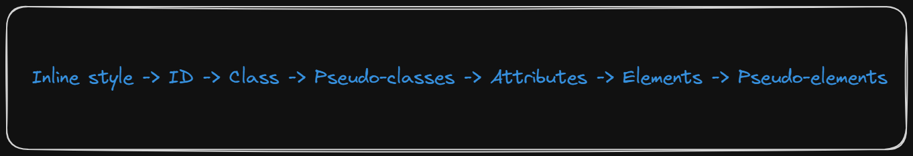

Inline style -> ID -> Class -> Pseudo-classes -> Attributes -> Elements -> Pseudo-elements

> <picture>
>   <source media="(prefers-color-scheme: light)" srcset="https://raw.githubusercontent.com/Mqxx/GitHub-Markdown/main/blockquotes/badge/light-theme/warning.svg">
>   
> </picture><br>
>
> Although not a used extensively we have `!important` tag that can be used to override the specificity precedence.

**Selector Combination**

We can combine selectors to create more specific selectors. There are three ways to combine selectors:

1. Descendant Combinator
2. Child Combinator
3. Adjacent Sibling Combinator

```css
/* 1. Child selector - Direct child*/
section>h2 {
  color: rgb(41, 207, 41);
}

/* 2. Descendant selector - Any child */
section h2 {
  color: rgb(41, 207, 41);
}


/* 3. Sibling selector */
h2~p {
  color: darkorchid;
}

/* 4. Adjacent sibling selector */
h2+a {
  color: deepskyblue;
}
```

### Units in CSS

There are two types of units in CSS:

1. Absolute Units
2. Relative Units

**Absolute Units**

Absolute units are fixed units. They are not relative to anything. They are:

- `px` - Pixels
- `pt` - Points
- `pc` - Picas
- `in` - Inches
- `cm` - Centimeters
- `mm` - Millimeters

**Relative Units**

Relative units are relative to something. They are:

- `em` - Relative to the font-size of the element
- `rem` - Relative to the font-size of the root element
- `vw` - Relative to 1% of the width of the viewport
- `vh` - Relative to 1% of the height of the viewport
- `vmin` - Relative to 1% of viewport's smaller dimension
- `vmax` - Relative to 1% of viewport's larger dimension
- `%` - Relative to the parent element

### CSS Box Model

Everything displayed by CSS is a box. So understanding this box model is very important. The box model is made up of the following:

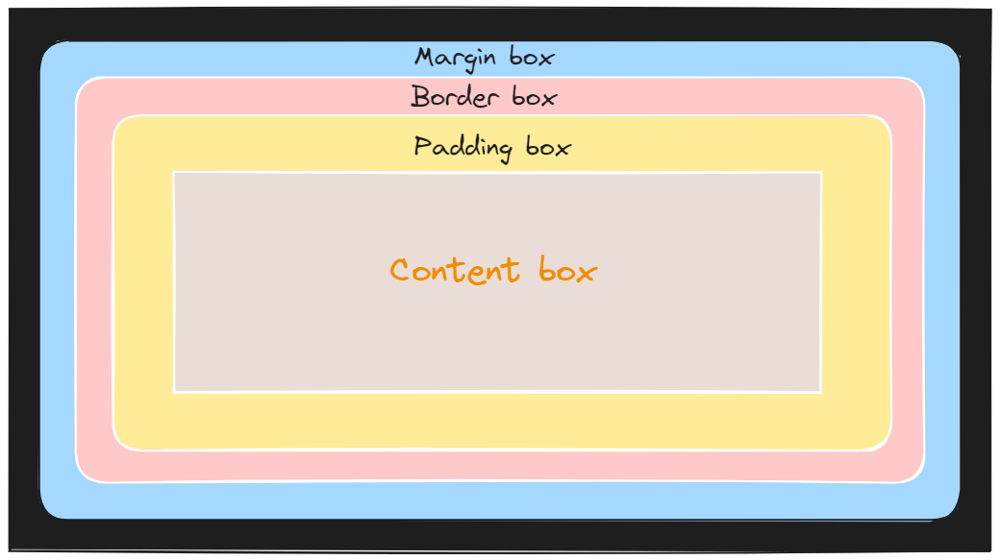

1. Content - This is the actual content of the box, it can be text, image, video etc.

2. Padding - This is the space between the content and the border of the box.

3. Border - This is the border of the box, it can be solid, dashed, dotted etc.

4. Margin - This is the space between the border of the box and the next element.

> <picture>
>   <source media="(prefers-color-scheme: light)" srcset="https://raw.githubusercontent.com/Mqxx/GitHub-Markdown/main/blockquotes/badge/light-theme/tip.svg">
>   
> </picture><br>
>
> One way to center a box is to set the width and the margin to `auto`.
>
>```css
>.box {
>  width: 50%;
>  margin: auto;
>}
>```

**Box-sizing**

The `box-sizing` property is used to tell the browser what the box model should include. The default value is `content-box`, which means that the width and height of the box does not include the padding and border. The other value is `border-box`. When we use `border-box` the padding and border are included in the width and height of the box.

```css
selector {
  box-sizing: value;
}

/* eg. */

* {
  box-sizing: border-box;
}
```

**Positioning**

The `position` property is used to position an element. They essentially help us to move an element from its default position. It has the following values:

1. `static` - This is the default value. It means that the element is positioned according to the normal flow of the document. It cannot be moved using the top, bottom, left, right properties.

```css
selector {
  position: static;
}

/* eg. */
.box {
  position: static;
}
```

2. `relative` - This means that the element is positioned relative to its normal position. It can be moved using the top, bottom, left, right properties.

```css
selector {
  position: relative;
}

/* eg. */
.box {
  position: relative;
  top: 10px;
  left: 10px;
}
```

3. `fixed` - This means that the element is positioned relative to the viewport. It can be moved using the top, bottom, left, right properties.

```css
selector {
  position: fixed;
}

/* eg. */
.box {
  position: fixed;
  top: 10px;
  left: 10px;
}
```

4. `absolute` - This means that the element is positioned relative to its first positioned ancestor. It can be moved using the top, bottom, left, right properties.

```css
selector {
  position: absolute;
}

/* eg. */
.box {
  position: absolute;
  top: 10px;
  left: 10px;
}
```

5. `sticky` - This means that the element is positioned based on the user's scroll position. It can be moved using the top, bottom, left, right properties.

```css
selector {
  position: sticky;
}

/* eg. */
.box {
  position: sticky;
  top: 10px;
  left: 10px;
}
```

- Inline elements does not have any effect on vertical padding and margin.

- When the content is too big for the container / box it is in, we call this `overflow`. We can use the `overflow` property to manage how an element handles overflow content. The values are `visible`, `hidden`, `scroll` and `auto`. The default value is `visible`.

- While margin can have negative values, padding cannot.

- The `display` property is used to change the display behavior of an element. The values are `block`, `inline`, `inline-block`, `flex`, `grid` and `none`. The default value is `block`.

- The `float` property is used to float an element to the left or right. The values are `left`, `right` and `none`. The default value is `none`.

- The `clear` property is used to specify which sides of an element where other floating elements are not allowed. The values are `left`, `right`, `both` and `none`. The default value is `none`.

### Flexbox

`Flexbox` is a layout mechanism designed for laying out groups of items in one dimension. The main idea behind the flex layout is to give the container the ability to alter its items’ width/height (and order) to best fill the available space. A flex container expands items to fill available free space or shrinks them to prevent overflow.

Flexbox layout is direction-agnostic unlike regular layouts (block - vertical-based, inline - horizontal-based).

> <picture>
>   <source media="(prefers-color-scheme: light)" srcset="https://raw.githubusercontent.com/Mqxx/GitHub-Markdown/main/blockquotes/badge/light-theme/note.svg">
>   
> </picture><br>
>
> If you are building a small scale website or preferably a layout consisting of one dimensional elements {Optional wrapping}, flexbox is the way to go. Using flex box is relatively easier than the older layout mechanisms.
>
> Also direct children of a flex container are called flex items.

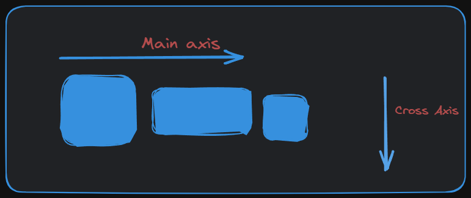

- The flex layout has two axes, the main axis and the cross axis.

**Basic terms in flexbox**

Since flexbox is a whole module and not a single property, it involves a lot of things including its whole set of properties. Some of them are meant to be set on the container (parent element, known as “flex container”) whereas the others are meant to be set on the children (said “flex items”).

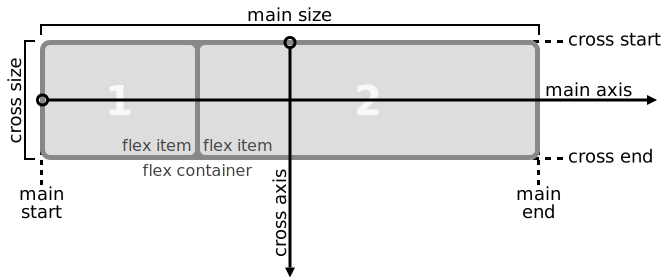

- `flex container` - The parent element that has `display: flex` set on it.

- `flex item` - The children of the flex container.

- `main axis` - The main axis of a flex container is the primary axis along which flex items are laid out. Not necessarily horizontal; it depends on the `flex-direction` property.

- `main-start | main-end` - The flex items are placed within the container starting from `main-start` and going to `main-end`.

- `main size` - The flex item’s main size property is either the ‘width’ or ‘height’ property, whichever is in the main dimension.

- `cross axis` - The axis perpendicular to the main axis is called the cross axis. Its direction depends on the main axis direction.

**Flexbox properties**

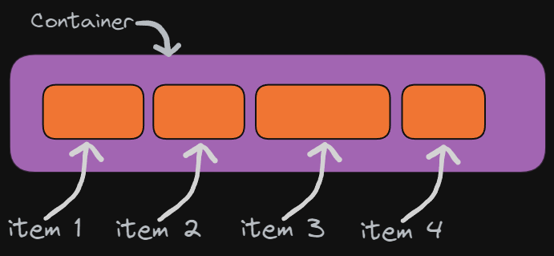

**Properties on Parent (Flex Container)**

- `display` - Defines the flex container, as inline or block; depending on the given value.

```css
.container {
  display: flex | inline-flex;
}
```

- `flex-direction` - Defines the main-axis, thus defining the direction flex items are placed in the flex container.

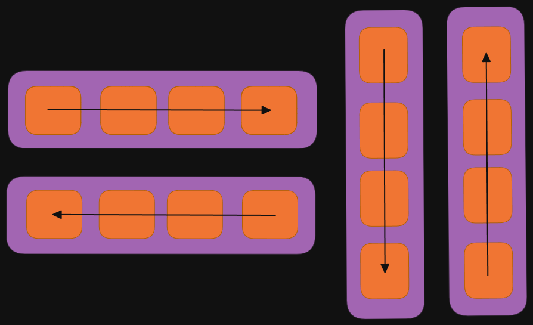

```css
.container {
  flex-direction: row | row-reverse | column | column-reverse;

  /* row (default): left to right in ltr; right to left in rtl */
  /* row-reverse: right to left in ltr; left to right in rtl */
  /* column: same as row but top to bottom */
  /* column-reverse: same as row-reverse but bottom to top */
}
```

- `flex-wrap` - By default, flex items will all try to fit onto one line. You can change that and allow the items to wrap as needed.

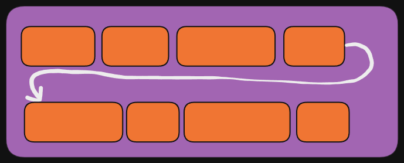

```css
.container {
  flex-wrap: nowrap | wrap | wrap-reverse;
}

/* nowrap (default): all flex items will be on one line */
/* wrap: flex items will wrap onto multiple lines, from top to bottom. */ 
/* wrap-reverse: flex items will wrap onto multiple lines from bottom to top. */
```

- `Justify-content` - Defines the alignment along the main axis. It helps distribute extra free space left over when either all the flex items on a line are inflexible, or are flexible but have reached their maximum size.

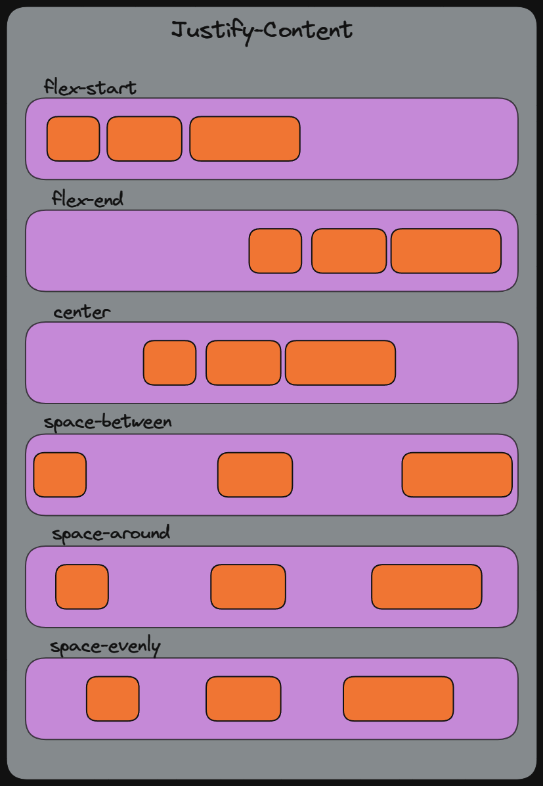

```css
.container {
  justify-content: flex-start | flex-end | center | space-between | space-around | space-evenly;
}

/* flex-start (default): items are packed toward the start of the flex-direction. */
/* flex-end: items are packed toward the end of the flex-direction. */
/* center: items are centered along the line. */
/* space-between: items are evenly distributed in the line; first item is on the start line, last item on the end line. */
/* space-around: items are evenly distributed in the line with equal space around them. */
/* space-evenly: items are distributed so that the spacing between any two items (and the space to the edges) is equal. Truly evenly spaced. */
```

- `align-items` - Defines the default behavior for how flex items are laid out along the cross axis on the current line. Like justify-content version for the cross-axis.

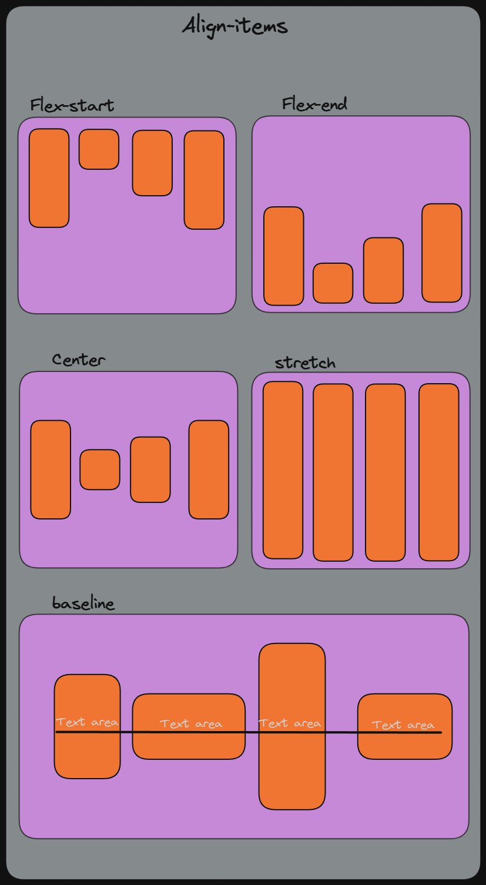

```css
.container {
  align-items: stretch | flex-start | flex-end | center | baseline;
}

/* stretch (default): stretch to fill the container (still respect min-width/max-width) */
/* flex-start / start / self-start: items are placed at the start of the cross axis. The difference between these is subtle, and is about respecting the flex-direction rules or the writing-mode rules. */
/* flex-end / end / self-end: items are placed at the end of the cross axis. The difference again is subtle and is about respecting flex-direction rules vs. writing-mode rules. */
/* center: items are centered in the cross-axis */
/* baseline: items are aligned such as their baselines align */
```

- `align-content` - This aligns a flex container’s lines within when there is extra space in the cross-axis, similar to how justify-content aligns individual items within the main-axis.

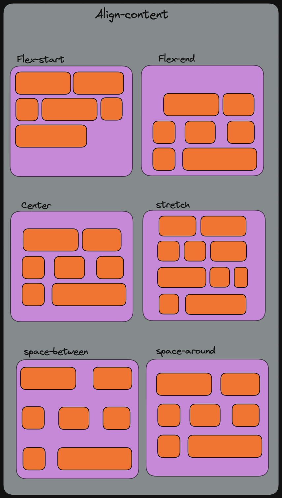

```css
.container {
  align-content: flex-start | flex-end | center | space-between | space-around | stretch;
}

/* flex-start / start: items packed to the start of the container. The (more supported) flex-start honors the flex-direction while start honors the writing-mode direction. */
/* flex-end / end: items packed to the end of the container. The (more support) flex-end honors the flex-direction while end honors the writing-mode direction. */
/* center: items centered in the container */
/* space-between: items evenly distributed; the first line is at the start of the container while the last one is at the end */
/* space-around: items evenly distributed with equal space around each line */
/* space-evenly: items are evenly distributed with equal space around them */
/* stretch (default): lines stretch to take up the remaining space */
```

> <picture>
>   <source media="(prefers-color-scheme: light)" srcset="https://raw.githubusercontent.com/Mqxx/GitHub-Markdown/main/blockquotes/badge/light-theme/note.svg">
>   
> </picture><br>
>
> The `align-content` property has no effect on single line non-wrapped flex containers. It needs multiline lines with flex-wrap set to either wrap or wrap-reverse

- `gap Property` - It controls the space between flex items. It applies that spacing only between items not on the outer edges. 

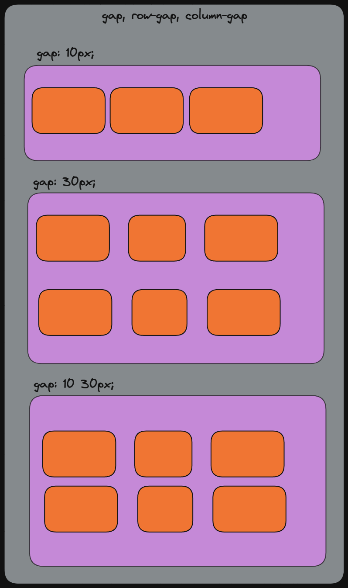

```css
.container {
  display: flex;
  ...
  gap: 10px;
  gap: 10px 20px; /* row-gap column gap */
  row-gap: 10px;
  column-gap: 20px;
}
```

> It is not exclusively for flexbox, gap works in grid and multi-column layout as well.

- `flex-flow` - This is a shorthand property for `flex-direction` and `flex-wrap` properties.

```css
.container {
  flex-flow: <‘flex-direction’> || <‘flex-wrap’>;
}
```

**Properties on Children (Flex Items)**

- `Order` - By default, flex items are laid out in the source order. However, the order property controls the order in which they appear in the flex container.

```css
.item {
  order: <integer>; /* default is 0 */
}
```

> We can typically use the order property something like this:

```css
.container{
  display: flex;
  height: 300px;
}

.child1{
  height: 100px;
  width: 200px;
  margin: auto;
}

div:nth-of-type(1){order: 3;} /* 1st element to appear 3rd */
```

- `flex-grow` - This defines the ability for a flex item to grow if necessary. It accepts a unit-less value that serves as a proportion. It dictates what amount of the available space inside the flex container the item should take.

If all items in the container has `flex-grow` set to 1, the remaining space in the container will be distributed equally to all children. If one of the children has a value of 2, the remaining space would take up twice as much space as the others (if possible).

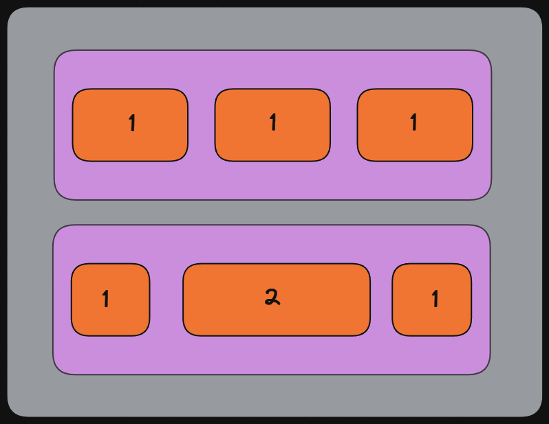

```css
.item {
  flex-grow: <number>; /* default 0 */
}
```

- `flex-shrink` - This defines the ability for a flex item to shrink if necessary.

```css
.item {
  flex-shrink: <number>; /* default 1 */
}
```

- `flex-basis` - This defines the default size of an element before the remaining space is distributed. It can be a length (e.g. 20%, 5rem, etc.) or a keyword. 

```css
.item {
  flex-basis: <length> | auto; /* default auto */

  /* available keywords: auto | content | max-content | min-content | fit-content */

  /*auto - the browser looks at the width/height of the item */
  /*content - size of the element’s content box */
  /*max-content - size of the largest content */  
  /*min-content - size of the smallest content */
  /*fit-content - size of the content box minus margins */
}
``` 

- `flex` - This is the shorthand for `flex-grow`, `flex-shrink` and `flex-basis` combined. The second and third parameters (flex-shrink and flex-basis) are optional. Default is 0 1 auto.

```css
.item {
  flex: none | [ <'flex-grow'> <'flex-shrink'>? || <'flex-basis'> ]
}
```

- `align-self` - This allows the default alignment (or the one specified by align-items) to be overridden for individual flex items.

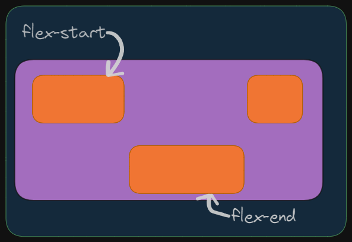

```css
.item {
  align-self: auto | flex-start | flex-end | center | baseline | stretch;
}
```

### Grid Layout

CSS Grid Layout is a 2-Dimensional grid based layout system. It is a whole module and not a single property. Some of them are meant to be set on the container (parent element, known as “grid container”) whereas the others are meant to be set on the children (“grid items”). It is considered to be the most powerful layout system available in CSS.

**Grid Terminologies**

- **`Grid Container`** : The element on which `display: grid` is applied. It’s the direct parent of all the grid items.

- **`Grid Item`** : The children (direct descendants) of the grid container.

- **`Grid Line`** : The lines that makes up the structure of the grid. They can be either vertical (“column grid lines”) or horizontal (“row grid lines”) and reside on either side of a row or column.

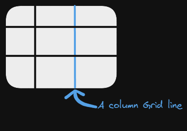

- **`Grid Cell`** : The space between two adjacent row and two adjacent column grid lines. It’s a single “unit” of the grid.

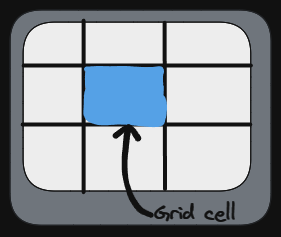

- **`Grid Track`** : The space between two adjacent grid lines. You can think of them like the columns or rows of the grid.

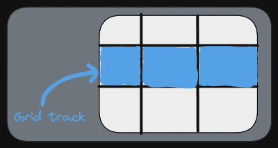

- **`Grid Area`** : The total space surrounded by four grid lines. A grid area may be comprised of any number of grid cells.

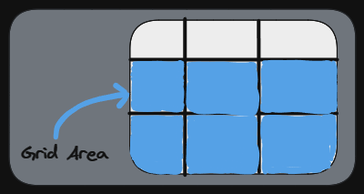


**Grid Properties**

**Properties on Parent (Grid Container)**

- `display` - Defines the element as a grid container and establishes a new grid formatting context for its contents.

```css
.container {
  display: grid | inline-grid;
  /* Other values: subgrid */
}
```

- `grid-template-columns` - Defines the columns of the grid with a space-separated list of values. The values represent the track size, and the space between them represents the grid line.

```css
.container {
  grid-template-columns: <track-size> ... | <line-name> <track-size> ...;
  /* One value for each column */
  /* <track-size> = <length> | <percentage> | <flex> | minmax(<min>, <max>) | fit-content(<length-percentage>) */
  /* <line-name> = <custom-name> */
}
```

- `grid-template-rows` - Defines the rows of the grid with a space-separated list of values. The values represent the track size, and the space between them represents the grid line.

```css
.container {
  grid-template-rows: <track-size> ... | <line-name> <track-size> ...;
  /* One value for each row */
  /* <track-size> = <length> | <percentage> | <flex> | minmax(<min>, <max>) | fit-content(<length-percentage>) */
  /* <line-name> = <custom-name> */
}
```

- `grid-template-areas` - Defines a grid template by referencing the names of the grid areas which are specified with the grid-area property. Repeating the name of a grid area causes the content to span those cells. A period signifies an empty cell. The syntax itself provides a visualization of the structure of the grid.

```css
.container {
  grid-template-areas: <grid-area-name> ... | <line-name> <grid-area-name> ...;
  /* One value for each row */
  /* <grid-area-name> = <custom-name> */
  /* <line-name> = <custom-name> */
}
```

- `grid-template` - A shorthand for setting `grid-template-rows`, `grid-template-columns`, and `grid-template-areas` in a single declaration.

```css
.container {
  grid-template: none | <grid-template-rows> / <grid-template-columns> | <grid-template-areas>;
}
```

- `grid-column-gap` - Specifies the size of the grid lines. You can think of it like setting the width of the gutters between the columns/rows.

```css
.container {
  grid-column-gap: <line-size>;
  /* <line-size> = <length> | <percentage> */
}
```

- `grid-row-gap` - Specifies the size of the grid lines. You can think of it like setting the width of the gutters between the columns/rows.

```css
.container {
  grid-row-gap: <line-size>;
  /* <line-size> = <length> | <percentage> */
}
```

- `grid-gap` - A shorthand for `grid-row-gap` and `grid-column-gap`.

```css
.container {
  grid-gap: <grid-row-gap> <grid-column-gap>;
}
```

- `justify-items` - Aligns grid items along the inline (row) axis (as opposed to align-items which aligns along the block (column) axis). This value applies to all grid items inside the container.

```css
.container {
  justify-items: start | end | center | stretch;
}
```

- `align-items` - Aligns grid items along the block (column) axis (as opposed to justify-items which aligns along the inline (row) axis). This value applies to all grid items inside the container.

```css
.container {
  align-items: start | end | center | stretch;
}
```

- `place-items` - A shorthand for align-items and justify-items.

```css
.container {
  place-items: <align-items> <justify-items>;
}
```

- `justify-content` - Aligns grid tracks along the inline (row) axis (as opposed to align-content which aligns along the block (column) axis). This value applies to all grid containers inside the parent.

```css
.container {
  justify-content: start | end | center | stretch | space-around | space-between | space-evenly;
}
```

- `align-content` - Aligns grid tracks along the block (column) axis (as opposed to justify-content which aligns along the inline (row) axis). This value applies to all grid containers inside the parent.

```css
.container {
  align-content: start | end | center | stretch | space-around | space-between | space-evenly;
}
```

- `place-content` - A shorthand for align-content and justify-content.

```css
.container {
  place-content: <align-content> <justify-content>;
}
```

- `grid-auto-columns` - Specifies the size of any auto-generated grid track. Auto-generated grid tracks are not the same as auto-placed tracks (which are created when grid items are placed outside of explicit grid tracks).

```css
.container {
  grid-auto-columns: <track-size>;
  /* <track-size> = <length> | <percentage> | <flex> | minmax(<min>, <max>) | fit-content(<length-percentage>) */
}
```

- `grid-auto-rows` - Specifies the size of any auto-generated grid track. Auto-generated grid tracks are not the same as auto-placed tracks (which are created when grid items are placed outside of explicit grid tracks).

```css
.container {
  grid-auto-rows: <track-size>;
  /* <track-size> = <length> | <percentage> | <flex> | minmax(<min>, <max>) | fit-content(<length-percentage>) */
}
```

- `grid-auto-flow` - Controls how auto-placed items are inserted in the grid. It has two values:

  - `row` - Auto-placed items are inserted along the row axis at the start of the implicit grid.
  - `column` - Auto-placed items are inserted along the column axis at the start of the implicit grid.

```css
.container {
  grid-auto-flow: row | column | dense;
}
```

- `grid` - A shorthand for setting `grid-template-rows`, `grid-template-columns`, `grid-template-areas`, `grid-auto-rows`, `grid-auto-columns`, and `grid-auto-flow` in a single declaration.

```css
.container {
  grid: none | <grid-template-rows> / <grid-template-columns> | <grid-template-areas> | <grid-auto-flow> [ <grid-auto-rows> ] [ / <grid-auto-columns> ];
}
```

**Properties on Children (Grid Items)**

- `grid-column-start` - Specifies a grid item’s start position within the grid column by contributing a line, a span, or nothing (automatic) to its grid placement, thereby specifying the inline-start and inline-end edge of its grid area.

```css
.item {
  grid-column-start: <number> | <name> | span <number> | span <name> | auto;
}
```

- `grid-column-end` - Specifies a grid item’s end position within the grid column by contributing a line, a span, or nothing (automatic) to its grid placement, thereby specifying the inline-start and inline-end edge of its grid area.

```css
.item {
  grid-column-end: <number> | <name> | span <number> | span <name> | auto;
}
```

- `grid-row-start` - Specifies a grid item’s start position within the grid row by contributing a line, a span, or nothing (automatic) to its grid placement, thereby specifying the block-start and block-end edge of its grid area.

```css
.item {
  grid-row-start: <number> | <name> | span <number> | span <name> | auto;
}
```

- `grid-row-end` - Specifies a grid item’s end position within the grid row by contributing a line, a span, or nothing (automatic) to its grid placement, thereby specifying the block-start and block-end edge of its grid area.

```css
.item {
  grid-row-end: <number> | <name> | span <number> | span <name> | auto;
}
```

- `grid-column` - A shorthand for `grid-column-start` and `grid-column-end`.

```css
.item {
  grid-column: <start-line> / <end-line> | <start-line> / span <value>;
}
```

- `grid-row` - A shorthand for `grid-row-start` and `grid-row-end`.

```css
.item {
  grid-row: <start-line> / <end-line> | <start-line> / span <value>;
}
```

- `grid-area` - Either specifies a name for the grid item, or this property is a shorthand for the grid-row-start, grid-column-start, grid-row-end, and grid-column-end properties, specifying a grid item’s size and location within the grid row by contributing a line, a span, or nothing (automatic) to its grid placement, thereby specifying the edges of its grid area.

```css
.item {
  grid-area: <name> | <row-start> / <column-start> / <row-end> / <column-end> | <row-start> / <column-start> / span <row-end> / span <column-end>;
}
```

- `justify-self` - Aligns a grid item inside a cell along the inline (row) axis (as opposed to align-self which aligns along the block (column) axis). This value applies to a grid item inside a single cell.

```css
.item {
  justify-self: start | end | center | stretch;
}
```

- `align-self` - Aligns a grid item inside a cell along the block (column) axis (as opposed to justify-self which aligns along the inline (row) axis). This value applies to a grid item inside a single cell.

```css
.item {
  align-self: start | end | center | stretch;
}
```

- `place-self` - A shorthand for align-self and justify-self.

```css
.item {
  place-self: <align-self> <justify-self>;
}
```
