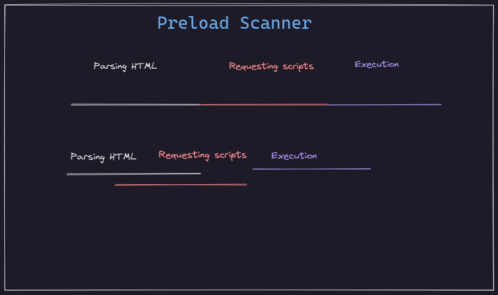

# How browsers render content ? 

At the end of the day the browser has to render the `html`, `css` and `JS` into UI that the user can interact with. The browser does this by following the **Critical Rendering Path**.

## Critical Rendering Path

The process of converting the HTML and files received from the server into a UI the User could interact with is known as **Critical Rendering Path**. It has 5 primary steps.

1. Parse HTML into `DOM Tree`. (Requests any resources found; images, scripts, stylesheet).
2. Parse CSS into CSS Object Model (`CSSOM`) tree.
3. Combines `DOM` and `CSSOM` into `render tree`.
4. Calculate the layout (width, height, location).
5. Paint.

## Dynamic Changes

- **Color change** : The browser will only repaint the node that changed.
- **Position change** : The browser will reflow the content and repaint the node that changed and all its siblings and children.
- **Major change** : The browser will reflow the content and repaint the whole page.

## Preload Scanner

## Key Performance Metrics

- **First paint / First contentful paint** : The time it takes for the browser to render the first pixel on the screen (Time taken to paint the first DOM element).
- **First meaningful paint** : The time it takes for the browser to render the first meaningful content on the screen (Time taken to paint the first DOM element that is visible to the user).
- **First interactive / Time to interactive** : The time it takes for the browser to become interactive (Time taken to respond to user input or click on buttons, etc.)

## How to optimize the Critical Rendering Path ?

- **Defer or async** : Load scripts asynchronously or defer them to the end of the page.
- **Minimize DOM size** : Minimize the number of DOM elements.
- **Reduce file size** : Minimize the size of the files (compression/minify).
- **Lazy loading** : Load images only when they are visible to the user and not requesting everything at once.
- **Hardware acceleration** : Use GPU to render content.
