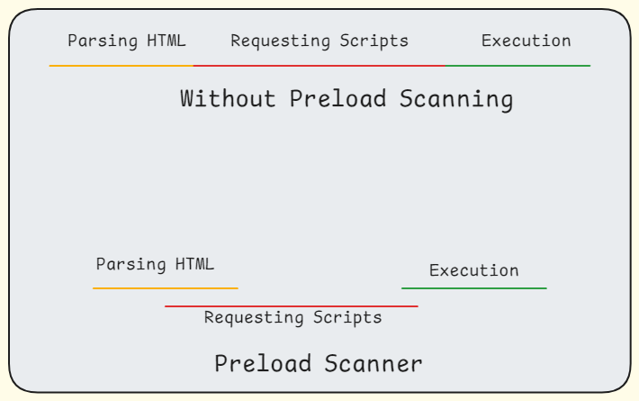

<h1 align="center">Rendering Content on the Browser</h1>

The browser converts `HTML`, `CSS`, and `JS` into an interactive UI. The **Critical Rendering Path** is the process of transforming HTML and related files from the server into a user interface. It involves five key steps:

The process of converting the HTML and files received from the server into a UI the User could interact with is known as **Critical Rendering Path**. It has 5 primary steps.

1. Parse HTML into a `DOM Tree`(Document Object Model) and requests any resources found, like images, scripts, stylesheets.

2. Parse CSS into the CSS Object Model (`CSSOM`) tree.

3. Combine the `DOM` and `CSSOM` into the `Render Tree`.

4. Calculate the layout (width, height, location).

5. Paint the content.

After the first content is painted; browser has to look any change in the DOM or CSSOM and repaint the content. Usually the browser would look for the following dynamic changes;

- **Color change**: The browser repaints only the affected node.

- **Position change**: The browser reflows content and repaints the affected node, its siblings, and children.

- **Major change**: The browser reflows and repaints the entire page.

## Preload Scanner

The browser uses a **Preload Scanner** to identify resources that are needed to render the page. It scans the HTML and CSS files to identify resources like images, scripts, and stylesheets. The browser then requests these resources from the server to render the page.

## Key Performance Metrics

- **First Paint / First Contentful Paint**: Time until the browser renders the first pixel on the screen.

- **First Meaningful Paint**: Time until the browser renders the first meaningful content visible to the user.

- **First Interactive / Time to Interactive**: Time until the browser becomes responsive to user input (e.g., clicking buttons).

## How to optimize the Critical Rendering Path

- **Defer or async**: Load scripts asynchronously or defer them until the end of the page.
- **Minimize DOM size**: Reduce the number of DOM elements.
- **Reduce file size**: Compress or minify files to reduce their size.
- **Lazy loading**: Load images only when they are visible to the user.
- **Hardware acceleration**: Use the GPU for rendering content.

## High level overview of Browsers

A web browser relies on several components working together to provide a seamless browsing experience. Here's an overview of the major components and their functions:

- **User Interface**: This includes menus, toolbars, and other visual elements that allow users to interact with the browser. It covers everything in the browser except the window displaying the requested page.

- **Rendering Engine**: This component interprets HTML, CSS, and JavaScript code to render web pages.
  > Examples include Blink (used by Google Chrome) and Gecko (used by Mozilla Firefox).

- **Browser Engine**: This manages the interaction between the rendering engine and the user interface, handling tasks like managing bookmarks, history, and extensions.
  > Examples include WebKit (used by Safari) and Trident (used by Internet Explorer).

- **Networking**: This component handles communication between the browser and the internet, managing HTTP requests, responses, and security protocols like HTTPS.
  > Examples include the TCP stack and DNS resolver.

- **JavaScript Engine**: This component executes JavaScript code on web pages.
  > Examples include V8 (used by Google Chrome) and SpiderMonkey (used by Mozilla Firefox).

- **Video Rendering**: This component renders video content on web pages.
  > Examples include WebM and H.264.

Other components include:
- Data storage
- UI backend
- Plugins/add-ons

> Read more about [Security](Web_Security.md)